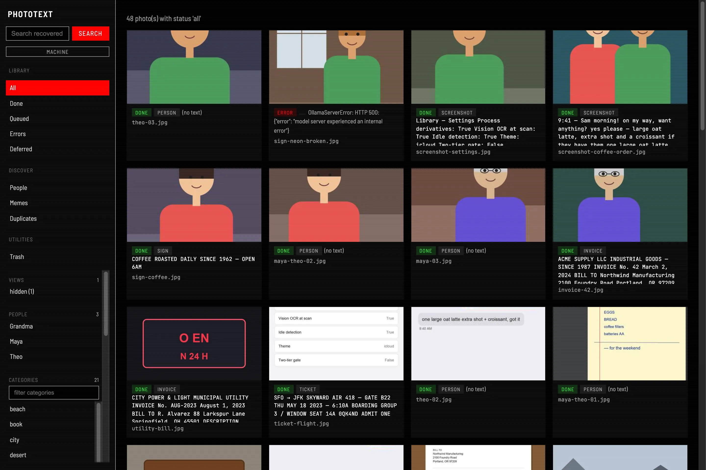
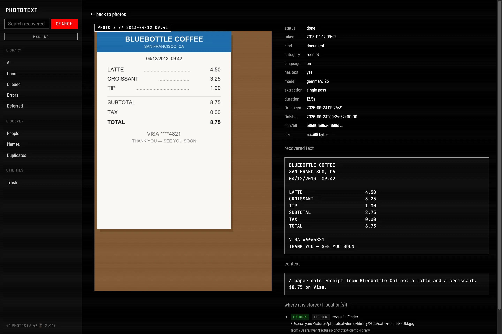
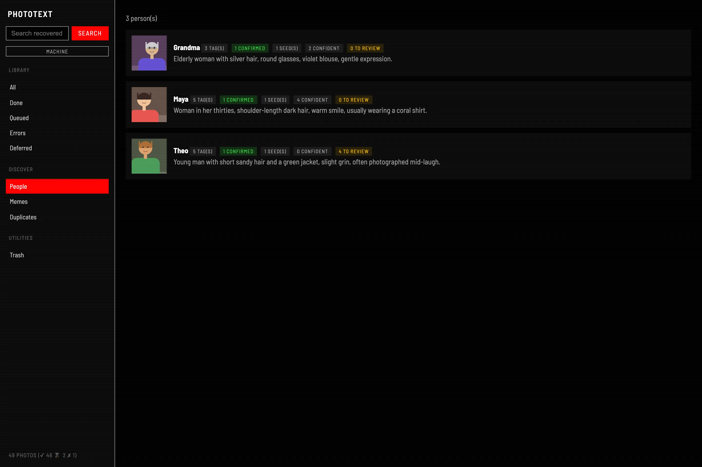
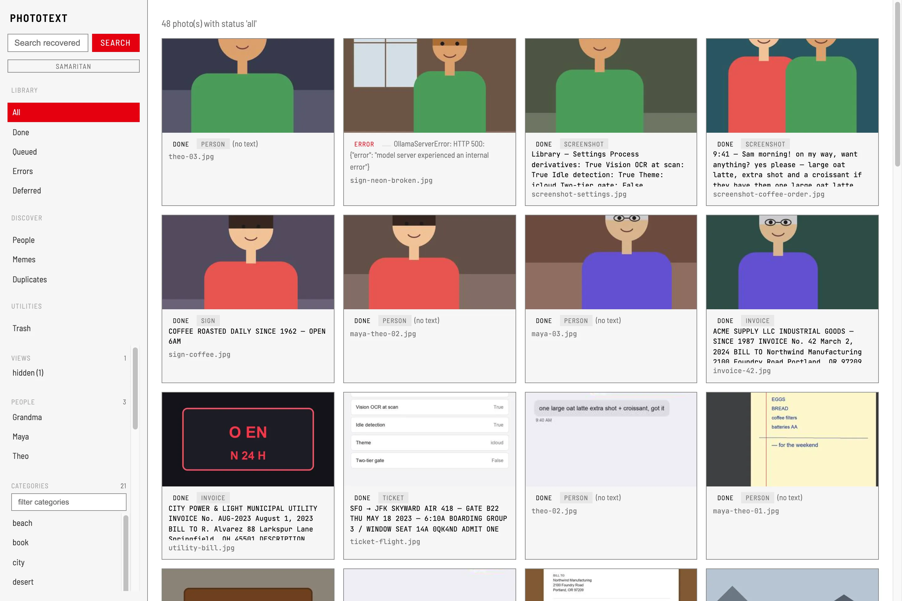
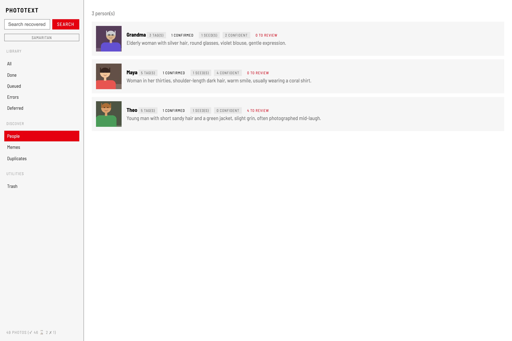

# Themes

The web UI ships three themes, switched by the button under the sidebar's
search box (the choice is saved per browser; a `web_theme` value in the
config sets the server default). Theme fonts (Barlow Semi Condensed, JetBrains
Mono) are self-hosted under SIL OFL, so the UI stays fully offline.

## iCloud

The default — a dark, iCloud-Photos-style chrome. The layout above is what
every theme shares; only the surface changes.

## Machine

Black and neon red, after the surveillance consoles in *Person of Interest*:
uppercase condensed type, mono captions, scanlines, and hover-acquisition
corner brackets on grid cards. The REC dot by the brand pulses while the
processing queue runs.

Detail pages get bracketed subject frames with designation tags, and the
recovered text renders terminal-styled:

Person cards carry the same chrome:

## Samaritan

The white-and-red counterpart: light surfaces, hairline frames, and the
same red accent discipline.

## Implementation notes

Themes are a single set of `--pt-*` CSS custom properties switched by the
`data-theme` attribute on `<html>`; a no-FOUC script restores the browser's
choice before first paint. PoI-only treatments (brackets, scanlines,
designations) are scoped to `html[data-theme='machine'/'samaritan']`
selectors so the iCloud look stays pixel-identical to the pre-theme UI.
