# The web UI

```bash
phototext serve                 # http://127.0.0.1:8765
```

A read-only local web app over the catalog, laid out like iCloud Photos: a
left sidebar with search, the Library / Discover / Utilities navigation, and
every filter, while the main area holds the photo grid, status tabs, and
per-photo pages. All screenshots below come from a
[synthetic demo catalog](demo/) — no real photos.

## Library

The grid shows every photo with a status badge, the model-assigned category,
and a snippet of the recovered text. The sidebar's filter groups (hidden
photos, people, categories, text/no-text, years) narrow the view; the REC dot
next to the brand pulses while the processing queue is active.

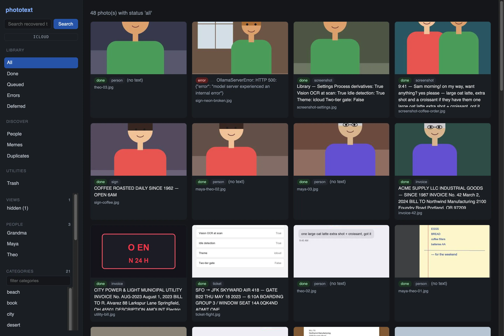

Status tabs cover `All / Done / Queued / Errors / Deferred`. A photo that
failed its model calls shows the error in place of text — fix the backend and
`phototext retry` picks it up.

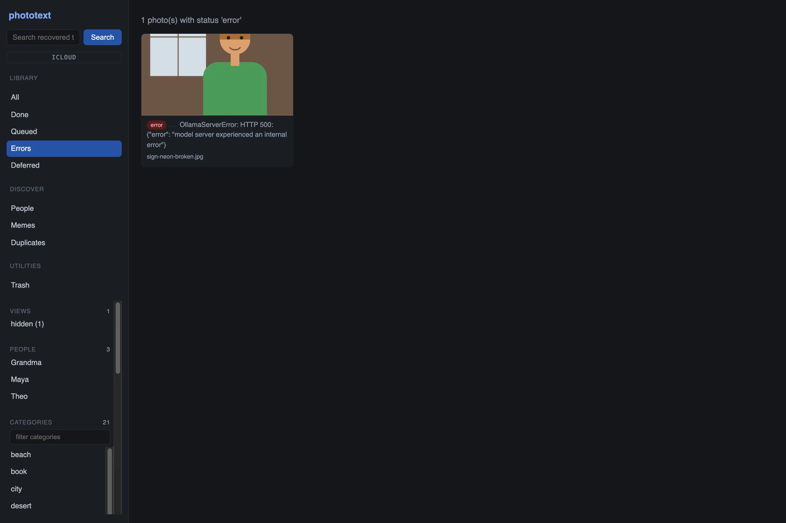

Capture dates (EXIF `DateTimeOriginal`, recorded at scan time) drive the year
chips, so the grid doubles as a timeline.

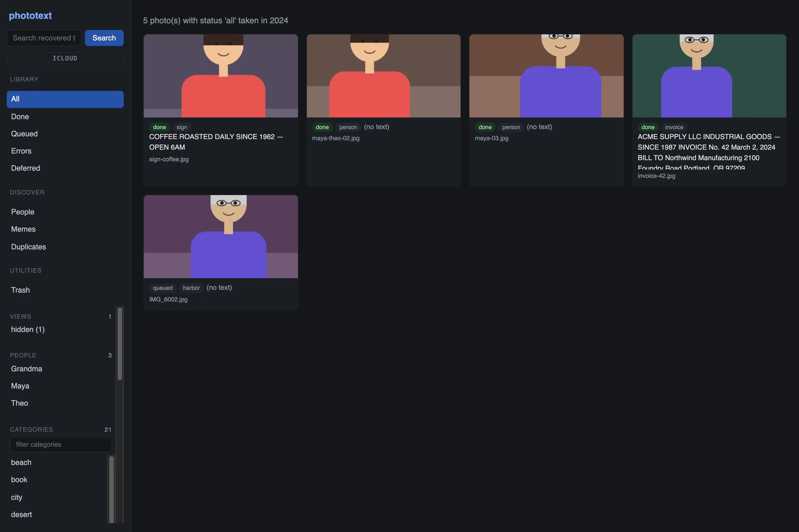

## Search

The search box runs full-text search (FTS5, phrases in double quotes) over
recovered text, context, and scan-time Vision OCR text — so a query like
`coffee` finds the café receipt, the coffee sign, the menu, and the chat
where you ordered one.

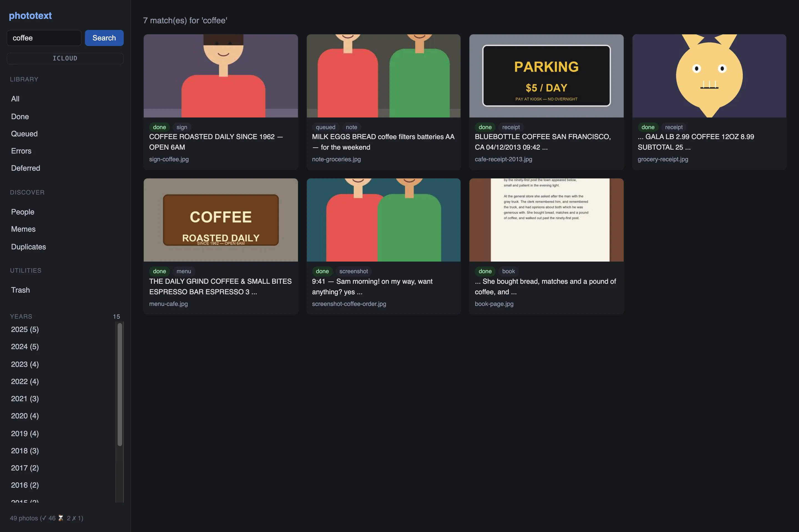

## Photo detail

Every photo page shows the image, the verbatim recovered text, the context
description, metadata (model, duration, category, language, SHA-256), and
**where the photo is really stored** — every on-disk location with its
source, an on-disk badge, and a *reveal in Finder* link that works inside
`.photolibrary`/`.photoslibrary` packages. Photos that live in a Photos
library also get an *open in Photos* link.

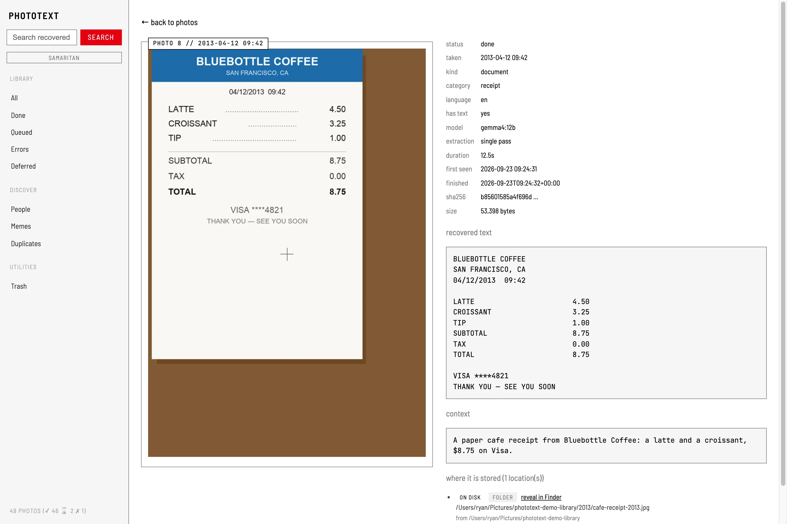

On read-only servers the image opens in a lightbox: click, wheel zoom-to-
cursor, drag pan, keyboard navigation.

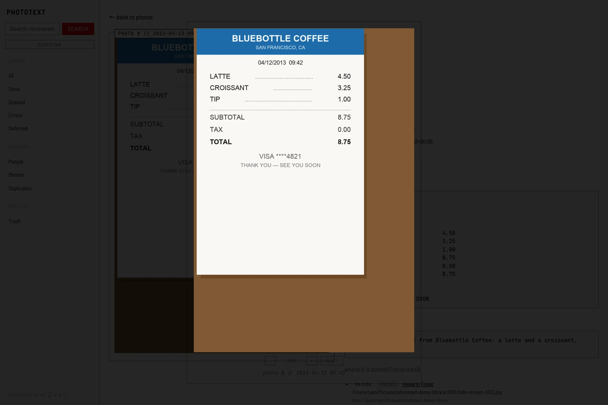

## People

Name a person once (drag a box around a face in writable mode, or
`phototext people name <id> <name>`) and `phototext people run` tags them
across the library. The People tab shows person cards grown from face crops,
with confirmed tags and a review queue for uncertain model matches.

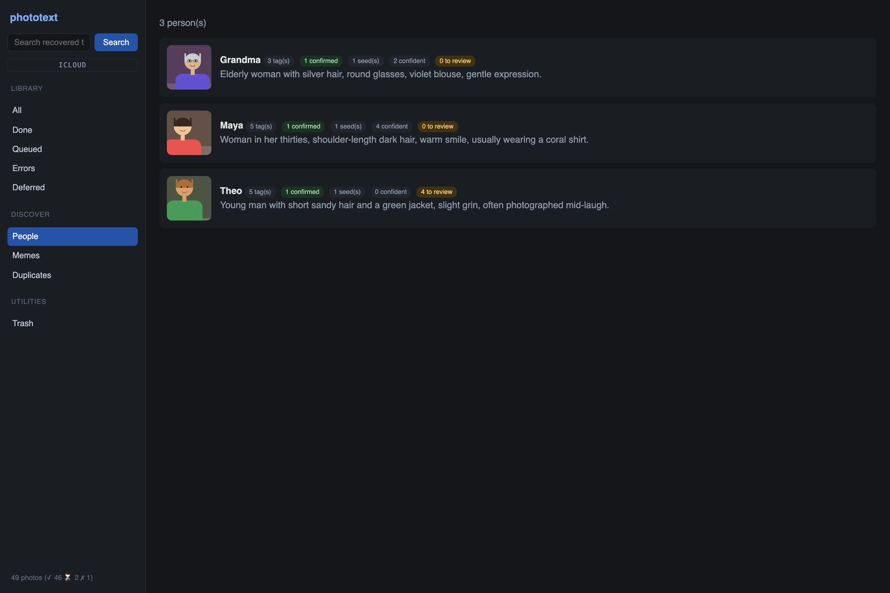

On a person's photo, the people chips show how each tag was established —
seed, confirmed, or a model match with its confidence (low-confidence tags
carry a *review* marker).

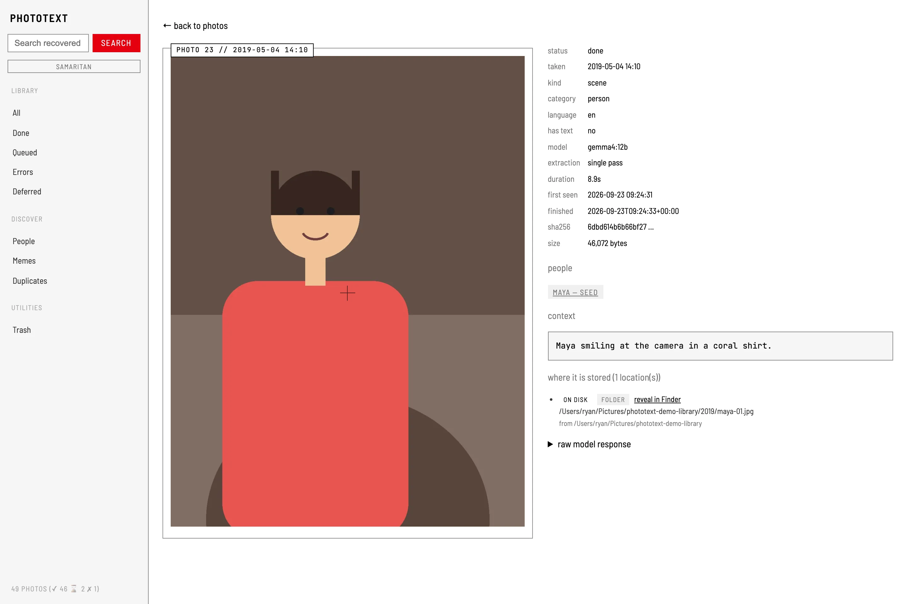

Each person page has the review queue: model tags below the confidence
threshold wait here until you confirm or remove them. Confirmed tags become
ground truth the model can never overwrite.

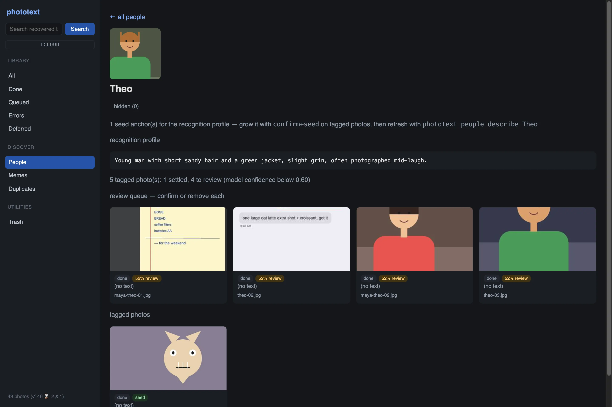

## Memes and duplicates

The **Memes** tab clusters near-identical photos by perceptual hash and
flags groups that carry text — the classic re-shared image.

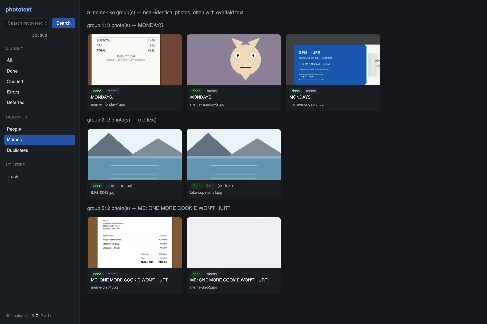

The **Duplicates** tab uses a tighter threshold and excludes iCloud preview
derivatives, so resized or re-encoded copies of the same photo group together
with the largest file marked as the one to keep.

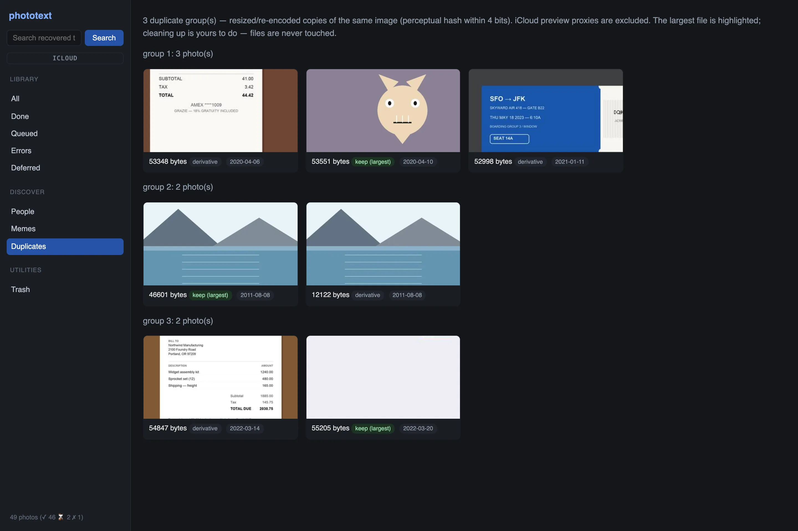

## Hidden, trash, and bulk actions

Photos hidden in the library (or by you) are out of the default views and
searches but still extracted — the *hidden* view lists them for unhiding.

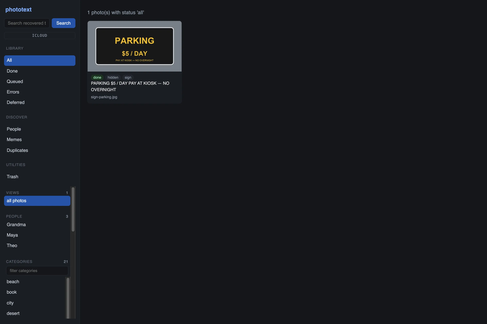

`hide`/`delete` only edit the catalog — files are never touched. Trashed
photos wait in the trash view until restored or purged.

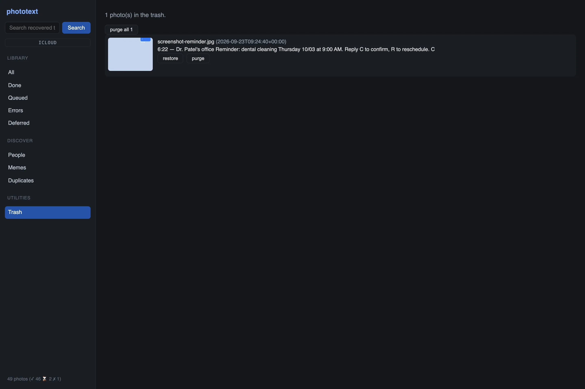

With `serve --writable` (session token + Origin check), every filtered view
grows a confirmed *delete all N in view* button — the selection is recomputed
server-side from the same filters and unfiltered requests are refused.

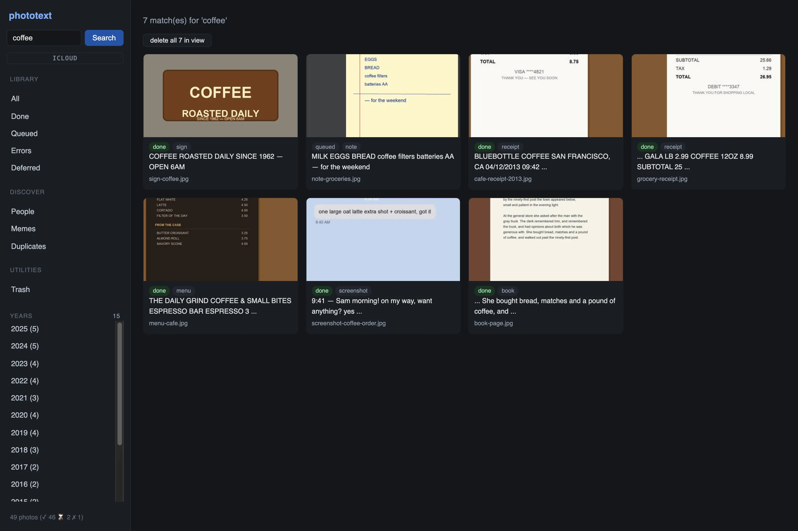

Writable mode also turns the photo page into a face-box picker: drag a
rectangle, type a name, and the person is seeded with a recognition profile
built on the spot.

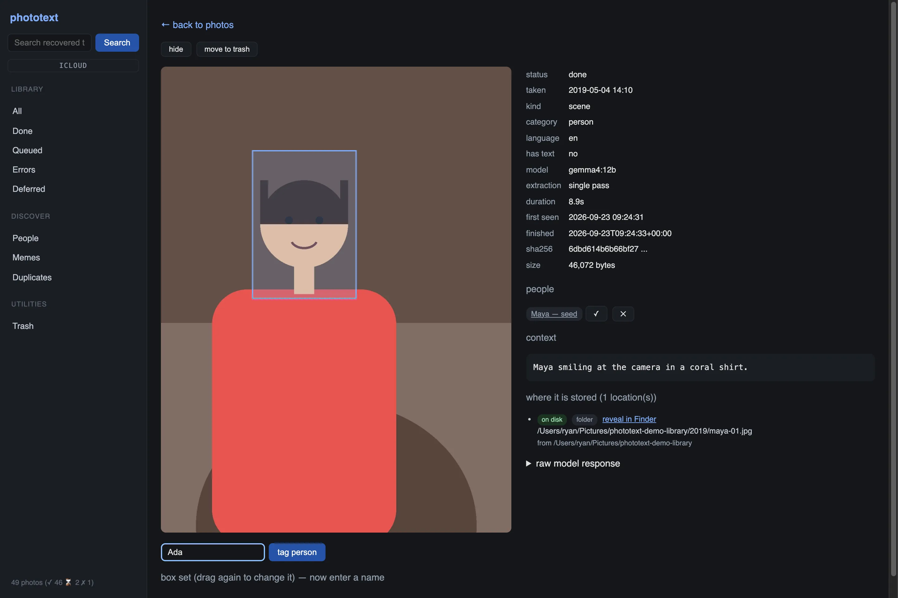

## Themes

The sidebar carries a theme switch with three looks — see
[the themes page](themes.md).
